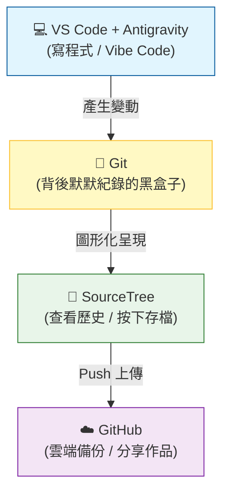

# 🚀 軟體開發入門：從 Vibe Code 到 Git 檔案管理

歡迎來到軟體開發的世界！這份指南是專為**完全不懂軟體、但想開始動手做**的初學者設計的。我們會用最直白的方式，告訴你這些看起來很專業的工具到底是做什麼用的、以及你該怎麼使用它們。

---

## 🏗️ 1. 核心工具大解密：誰是誰？

想像你在蓋一棟房子，你需要不同的工具與場地：

### 🖥️ VS Code + Antigravity (你的 AI 創作中心)
*   **角色**：你的**智慧工作台**。
*   **功能**：這是你寫程式、看成果的地方。**對於初學者來說，你可以將它們視為同一個東西**：VS Code 是你的畫布，而 Antigravity 是幫你拿畫筆的智慧助手。
*   **建議**：初學者只要選擇進入這個「創作環境」即可，不需要分開學習。你可以直接在裡面對著 AI 說出你的想法（這就是所謂的 **Vibe Code**）。
*   **💡 應用場景**：你想做一個「待辦清單」網頁。你只需要在 VS Code 打開一個新檔案，對 Antigravity 說：「幫我用 HTML/CSS 寫一個粉紅色主題的待辦清單」，它就會直接在你面前把程式碼「變」出來。

### 🐙 GitHub
*   **角色**：你的**雲端保險箱與展示櫃**。
*   **功能**：你寫好的東西會傳到這裡備份。別人也可以在這裡看到你的作品，它是全世界程式設計師的社交平台。
*   **💡 應用場景**：如果你電腦不小心噴到咖啡壞掉了，只要你有把程式碼「Push」到 GitHub，換台電腦登入後，所有的程式碼都能一秒找回來。

### 🌳 SourceTree
*   **角色**：你的**地圖與遙控器**。
*   **功能**：Git 本身像是一個隱藏在背景的黑盒子，SourceTree 是把裡面的資料畫成漂亮的「樹狀圖」。你可以清楚看到：「誰在兩天前改了什麼？」，這比輸入一行行的指令（Terminal）要直觀得多。
*   **💡 應用場景**：你昨晚寫得很順，但今天早上 AI 幫你改了一個功能後，整個網頁突然動不了了。你可以打開 SourceTree，找到昨天那個「正確的點」，按一下滑鼠就能讓時間倒流。

---

## 📊 2. 工具差異對照表

| 工具組合 | 類型 | 核心用途 | 什麼時候用它？ |
| :--- | :--- | :--- | :--- |
| **VS Code / Antigravity** | **AI 創作中心** | 撰寫程式、實現想法 | **想做東西時**。直接用說的（Vibe）請 AI 幫你寫出代碼。 |
| **GitHub** | **雲端保險箱** | 備份、分享程式碼 | **想存檔到雲端時**。確保電腦壞了東西還在。 |
| **SourceTree** | **時光機面板** | 視覺化管理檔案版本 | **想看紀錄時**。清楚看到「之前改了什麼」，不小心寫壞了也能一鍵還原。 |

---

## 🧭 3. 開發工具連連看 (資訊流)

這張圖呈現了當你寫程式時，資料是怎麼流動的：

---

## ⚙️ 4. 它們如何協作？（資訊流導覽）

當你今天想做一個新功能，流程通常是這樣的：

1.  **開啟 VS Code**：打開你的專案檔案。
2.  **求助 Antigravity**：跟 AI 說：「幫我做一個航班追蹤器」。AI 會在 VS Code 幫你寫出程式碼。
3.  **確認成果**：你在電腦上看到功能跑起來了，感覺很棒（Good Vibe）。
4.  **打開 SourceTree**：你會看到 SourceTree 右上角出現紅色的數字，這代表「檔案有變動囉！」。
5.  **Commit (存檔點)**：就像在影片中提到的「模特兒拍快照」，你透過 SourceTree 幫這次的改動貼上一張小貼紙（Commit Message），寫著：「新增航班追蹤功能」。
6.  **Push (上傳)**：按下 SourceTree 頂部的 **「推送 (Push)」** 按鈕，把這個改動傳送到 **GitHub**。

---

## 🎨 5. 為什麼要用 SourceTree 而不是只用 VS Code？

雖然 VS Code 裡面也可以做基本的 Git 操作，但對初學者來說，分開工具的好處很多：

| 操作方式 | 適合對象 | 優點 | 缺點 |
| :--- | :--- | :--- | :--- |
| **Terminal (指令式)** | 專業開發者 | 速度極快、功能最全 | 門檻極高，錯一個字就報錯 |
| **VS Code (內建)** | 中階開發者 | 不用切視窗，方便 | 介面擁擠，看不清整體的「分支樹」 |
| **SourceTree (圖形化)** | **初學者 / 視覺派** | **一目了然的線條、直觀的存檔點** | 需要額外開一個視窗 |

**為什麼初學者首選 SourceTree？**
1.  **看見歷史**：它能把抽象的「版本」畫成樹狀圖，讓你看到代碼是怎麼分岔又怎麼合併的。
2.  **安全性**：在按下按鈕前，你可以清楚看到「我到底改了哪幾行」，避免不小心存了錯誤的代碼。

---

## 🤖 6. Antigravity 如何幫你處理 Git？

AI 不只能寫程式，它也是你的 Git 隨身教練：

*   **自動撰寫 Commit 訊息**：
    *   **怎麼做？**：你可以把改動的程式碼貼給 AI，問它：「幫我依照目前的變更寫一個專業的 Commit Message，要包含為何修改」。
    *   **為什麼要這樣？**：以後回頭看紀錄時，你會感謝 AI 幫你寫得很清楚。
*   **解讀衝突 (Conflict)**：
    *   **怎麼做？**：當 SourceTree 出現驚嘆號說「衝突」時，把那段程式碼丟給 AI：「有兩個人改了同一個地方，請幫我分析哪一個版本才是正確的，或者幫我合併它們」。
*   **操作指令翻譯**：你可以問 AI：「我想把目前的進度先存起來但不提交（Stash），在 SourceTree 該按哪裡？」

---

## 🚀 7. 實戰演練：你的第一次存檔 (First Commit)

結合電子書《為你自己學 Git》的精華，我們來練習一次：

1.  **在 VS Code 修改檔案**：打開 `README.md`，在最下面加一行：「這是我的第一次 Git 練習！」。
2.  **切換到 SourceTree**：
    *   點擊左側導覽列的 **「檔案狀態 (File Status)」**。
    *   你會在下方的 **「未暫存檔案 (Unstaged Files)」** 看到 `README.md` 左邊有個橘色圖示。
3.  **Stage (站好位)**：
    *   勾選 `README.md` 前方的方框。
    *   檔案會跳到上方的 **「已暫存檔案 (Staged Files)」**。
    *   *💡 這就像是在攝影棚請模特兒站好位，準備拍照。*
4.  **Commit (按快門)**：
    *   在下方的文字方塊輸入：「實作第一次 Git 練習」。
    *   按下右下角的 **「提交 (Commit)」** 按鈕。
    *   *💡 喀擦！你已經建立了一個存檔點。*
5.  **Push (同步到雲端)**：
    *   點選最上方工具列的 **「推送 (Push)」**。
    *   確認打勾後按下確定。
    *   *💡 恭喜！你的代碼已經上傳到 GitHub 了！*

## 💊 8. 初學者的「後悔藥」：做錯了怎麼辦？

在學 Git 的路上，你一定會遇到「啊，我不小心改壞了」的時候。別擔心，SourceTree 就是你的時光機面板：

*   **還沒存檔 (Commit) 前就想反悔**：
    *   **場景**：你改了半天發現方向錯了，想回到這份檔案最原始的樣子。
    *   **做法**：在 SourceTree 對著該檔案點右鍵，選擇 **「捨棄 (Discard)」**。這會像橡皮擦一樣把你的改動抹掉。
*   **剛按下存檔 (Commit) 但發現打錯字**：
    *   **場景**：Commit 訊息寫錯了，或者少勾了一個檔案。
    *   **做法**：勾選下方的 **「修改最後一次提交 (Amend last commit)」**，這能讓你把新的東西塞進上一個存檔點裡。
*   **想回到很久以前的某個版本**：
    *   **場景**：昨天的版本比較好，今天的都被我改爛了。
    *   **做法**：在 SourceTree 的歷史紀錄中找到那個點，點右鍵選擇 **「重置 (Reset)」**。初學者建議選擇 **「Hard (硬性重置)」**（**注意：這會清掉你目前所有還沒存檔的東西，請謹慎使用！**）。

---

## 📚 9. 學習資源推薦

*   **電子書**：《為你自己學 Git》(高見龍著) - 這是一本非常親民的書，推薦從「第四章：Git 的基本操作」開始看起。
*   **影音導引**：[YouTube 基礎教學](https://www.youtube.com/watch?v=FKXRiAiQFiY) - 配合著本指南一起看，你會對「遠端倉庫 (Repo)」更有概念。

---

## 💡 10. 給初學者的 Vibe Code 心法

1.  **先求 Vibe (感覺)，再求懂**：不需要一開始就把 Git 指令背起來。先讓 Antigravity 幫你做出東西。
2.  **小步存檔 (Commit)**：每次 AI 幫你做完一個小功能，就去 SourceTree 按下「Commit」。這就像玩遊戲過關後的存檔，萬一下一秒 AI 把程式寫爛了，你隨時可以「讀檔」回到最棒的時刻。
3.  **看圖識字**：配合電子書《為你自己學 Git》，看書裡的圖解，再對照 SourceTree 裡的線條，你會發現 Git 其實就是一棵會長大的樹。
